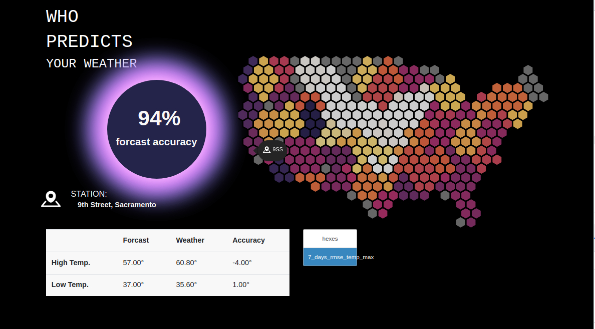

# Hex Tessellated GeoJSON From a Series of Geographic Coordinates in JSON Format

### The Django Framework
**Views.py**: Backend Python script for the webpage.  
1. **Index**: Script for rendering the map URL.  
2. **Geofile**: Script for converting JSON to GeoJSON and hosting it in the `weathermap/geofile` URL path.

**urls.py**: Contains the two URL paths.

urlpatterns = [
    path("weathermap", views.index, name="index"),
    path("weathermap/geofile", views.geofile, name="geofile"),
]

Conversion Scripts

    convertpoint.py: Converts a JSON file to a GeoJSON file with a single point.
    convertsquare.py: Converts a JSON file to GeoJSON as a square.
    converhex.py: Script in progress to convert to a tessellated hex map. Currently, hex maps are generated manually using pyEAC.

Current Implementation

The views.py script currently converts to squares:

    If you delete geodata/test.geojson and load the webpage locally, a new test file will generate and host.
    To view hex placement, change the output in views.py under the def geofile function to the hex path below. This will render the hex tessellation of the data when the map loads.

geodata.testhex.geojson contains the correct hex tessellation in the GeoJSON format. Ideally, the backend data should store this information for each location instead of regenerating tessellation every time the user loads the page.

I attempted to parse the coordinates and attach them to the backend JSON as a reference but encountered challenges. For now, manual adjustments might be more practical.
File Descriptions

    bengie/weather/map/templates/map/weathermap.html: Contains the JavaScript for the current map.
        Currently, it's buggy—popups do not work with the new polygon generations but function with point placements. This is not yet implemented in the environment via views.py.

    bengie/weather/map/templates/map/geotest.html: Blank template where the JSON file populates.

    bengie/weather/map/templates/map/layout.html: Boilerplate layout for the page.

Future Work

Models and forms.py: These can be utilized to manipulate data for user interaction. Ideally, the backend data would eventually be set up as a model in Django.
Django References

https://cs50.harvard.edu/web/2020/notes/3/
https://youtu.be/w8q0C-C1js4?list=TLPQMjUxMDIwMjK8z4urEoom4w
